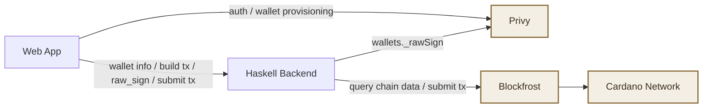
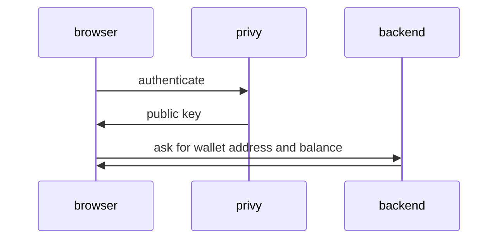
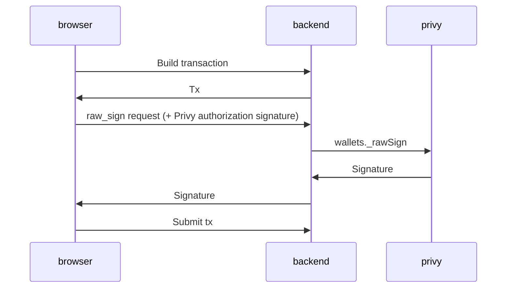

# privy-cardano-poc

Experimental integration of [privy.io](https://www.privy.io/) SDK with Cardano.
With this integration you can send funds on Cardano using privy's authentication and key management, without needing a browser wallet.

## Project Structure

* The main app is in `src/ui`. It's a React web app (built with Vite) that uses Privy SDK for authentication. You can look at your Cardano balance and send and receive funds.
* There is a Haskell backend in `src/backend`. It's a stateless HTTP server with an OpenAPI interface documented [here](src/openapi/schema.json).
  It handles transaction building/submission and proxies `raw_sign` requests to Privy using backend-held app credentials.



Privy is used for:
* Managing the private key in its TEE
* Exporting the public key
* Signing transaction body hashes with the private key using Ed25519 scheme

The Haskell backend is responsible for:
* Converting the public key to a Cardano address
* Querying the balance of said address
* Constructing unsigned transactions that spend money from the address
* Forwarding `raw_sign` requests to Privy with server-side `PRIVY_APP_ID` / `PRIVY_APP_SECRET`
* Combining unsigned transactions and raw signatures (from Privy) to finalised Cardano transactions and sending them to the network

### Wallets on Privy

When the app starts it generated a SUI wallet on Privy. SUI has the signature algorithm as Cardano, so we're piggy-backing off of privy's SUI support.

> [!TIP]
> We recommend not using this SUI wallet for actual transactions on SUI.

## Development

### Setting up the .env file

* Create an account on [Privy](https://dashboard.privy.io/)
* On Privy, create an app, a client, and a secret.
* Get a Blockfrost project key, `$BLOCKFROST_KEY` for the Haskell backend. This key will determine which Cardano network you connect to (preview, preprod, mainnet).
* Configure environment `.env` based on `.env.example`
  * Frontend build-time vars (see `src/ui/.env.example`): `VITE_PRIVY_APP_ID`, `VITE_PRIVY_CLIENT_ID`, `VITE_PRIVY_CARDANO_SERVER_URL`
  * Backend runtime vars: `PRIVY_CARDANO_BLOCKFROST_PROJECT`, `PRIVY_APP_ID`, `PRIVY_APP_SECRET`

### Running the app locally

You can run the entire app locally, without nix, npm or the Haskell toolchain.
Just define the `.env` as above and then run

```bash
podman run --rm -p 127.0.0.1:8080:8080 -w /work -v "$PWD/.env:/work/.env:ro" ghcr.io/j-mueller/privy-cardano-cli:latest
```

Then open the app on localhost:8080.

### Local Testing

* Start Haskell server (choose one):
  * Build image and run with podman via nix app (mounts `.env` automatically): `nix run .#privy-cardano-cli`
  * Run with podman (sources local `.env` from mounted working directory): `podman run --rm -p 127.0.0.1:8080:8080 -w /work/.env -v "$PWD/.env:/work/.env:ro" ghcr.io/j-mueller/privy-cardano-cli:latest`
* Build and serve frontend: `cd src/ui && npm install && npm run dev`
* Open app in browser

## Screenshot


## Control Flow

### Initialisation

We authenticate with privy and ask for the user's public key.
Then we use this public key to determine the user's Cardano address.



### Building a transaction


