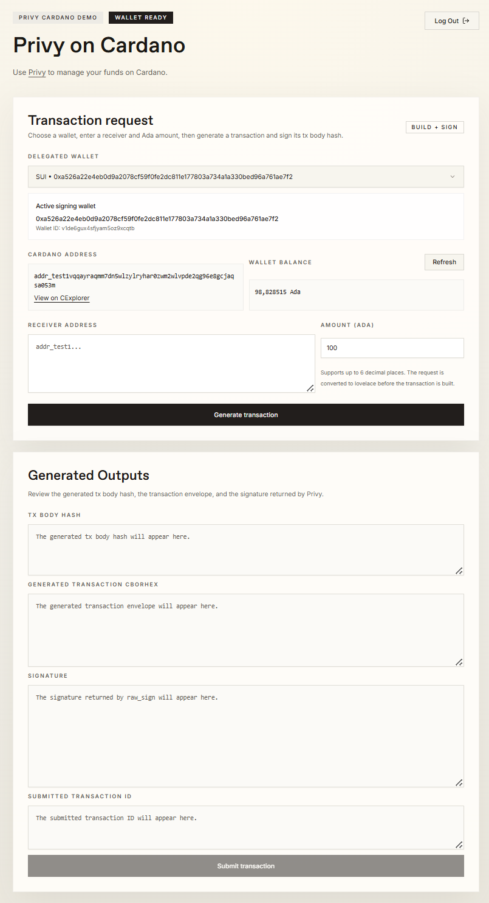
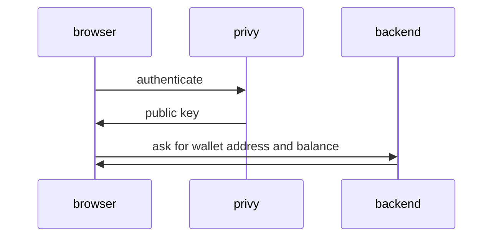
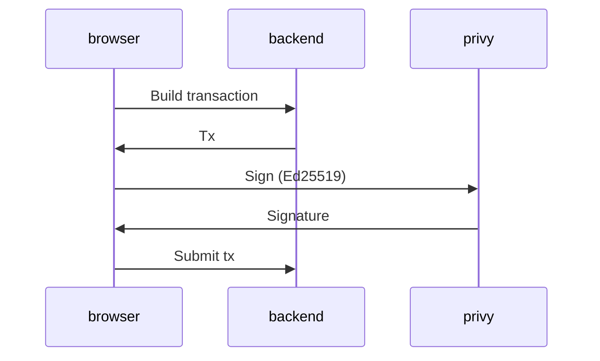

# privy-cardano-poc

Experimental integration of [privy.io](https://www.privy.io/) SDK with Cardano.
With this integration you can send funds on Cardano using privy's authentication and key management, without needing a browser wallet.

## Project Structure

* The main app is in 'src/ui'. It's a vite/react web app that uses Privy SDK for authentication. You can look at your Cardano balance and send and receive funds.
* There is a Haskell backend for transaction building in 'src/backend'. It's a stateless HTTP server with an OpenAPI interface documented [here](src/openapi/schema.json).

Privy is used for:
* Managing the private key in its TEE
* Exporting the public key
* Signing transaction body hashes with the private key using Ed25119 scheme

The Haskell backend is responsible for:
* Converting the public key to a Cardano address
* Querying the balance of said address
* Constructing unsigned transactions that spend money from the address
* Combining unsigned transactions and raw signatures (from Privy) to finalised Cardano transactions and sending them to the network

### Wallets on Privy

When the app starts it generated a SUI wallet on Privy. SUI has the signature algorithm as Cardano, so we're piggy-backing off of privy's SUI support.

## Testing

* Create an account on [Privy](https://dashboard.privy.io/)
* On Privy, create an app, a client, and a secret. Put all of them in the .env file (see 'src/ui/.env.example' for the variables that we need)
* Get a Blockfrost project key, $BLOCKFROST_KEY for the Haskell backend
* Start Haskell server with 'PRIVY_CARDANO_BLOCKFROST_PROJECT=$BLOCKFROST_KEY nix run .#privy-cardano-cli'
* Set up frontend: 'cd src/ui && npm install'
* Start frontend: 'cd src/ui && npm run dev'
* Open website in browser, login with email or social

## Screenshot

## Control Flow

### Initialisation

We authenticate with privy and ask for the user's public key.
Then we use this public key to determine the user's Cardano address.

### Building a transaction

