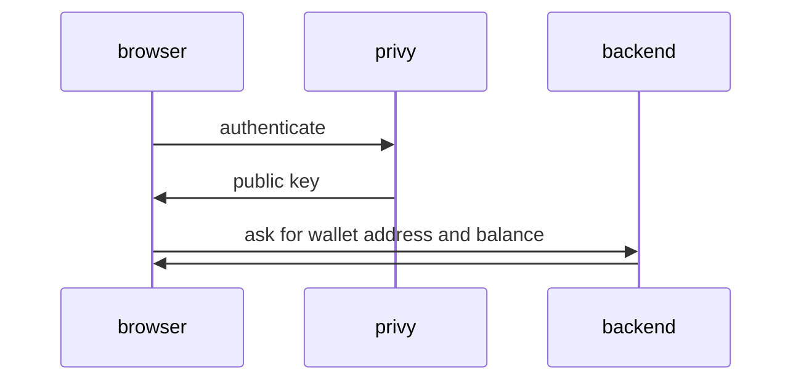
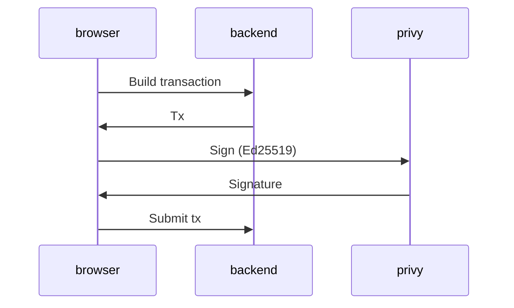

# privy-cardano-poc

Experimental integration of [privy.io](https://www.privy.io/) with Cardano

## Control Flow

### Initialisation

We authenticate with privy and ask for the user's public key.
Then we use this public key to determine the user's Cardano address.

### Building a transaction

